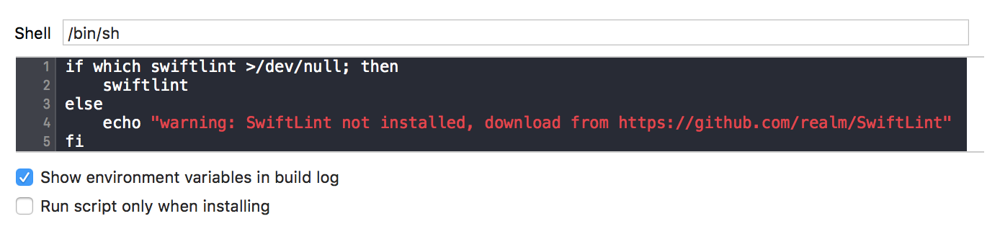

# Xcode project setup

Currently worki **Xcode**. If you want to learn about StackEdit, you can read me. If you want to play with Markdown, you can edit me. Once you have finished with me, you can create new files by opening the **file explorer** on the left corner of the navigation bar.


# Quick Reference
| Feature | Link |
| ------ | ------ |
| Coordinator Template | https://github.com/dimebt/Coordinator-Xcode-Project-Swift-Template |
| SwiftLint | https://github.com/realm/SwiftLint |
| Google Drive | [plugins/googledrive/README.md][PlGd] |
| OneDrive | [plugins/onedrive/README.md][PlOd] |
| Medium | [plugins/medium/README.md][PlMe] |
| Google Analytics | [plugins/googleanalytics/README.md][PlGa] |


## Coordinator Template
Xcode 11 Template to use as a starting point for an iOS apps.

https://github.com/dimebt/Coordinator-Xcode-Project-Swift-Template

## SwiftLint
A tool to enforce Swift style and conventions

https://github.com/realm/SwiftLint

### Installation

#### Using [Homebrew](http://brew.sh/):

```
brew install swiftlint
```

#### Xcode

Integrate SwiftLint into an Xcode scheme to get warnings and errors displayed
in the IDE. Just add a new "Run Script Phase" with:

```bash
if which swiftlint >/dev/null; then
  swiftlint
else
  echo "warning: SwiftLint not installed, download from https://github.com/realm/SwiftLint"
fi
```




## Fastlane integration
### snapshot

## Travis CI Setup
## Codecov Setup
## DI Container
## Cocoapods libraries
### PromiseKit or Combine 
### Lottie
### SwiftyBeaver console, file, cloud logger


